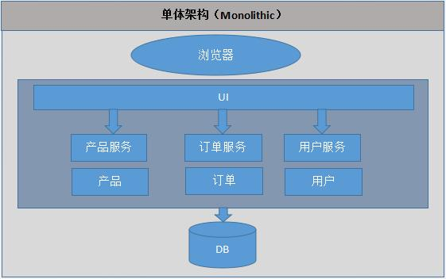
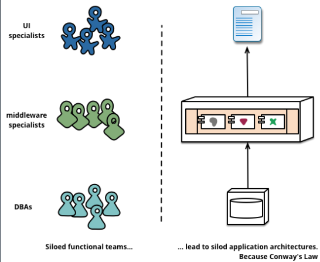
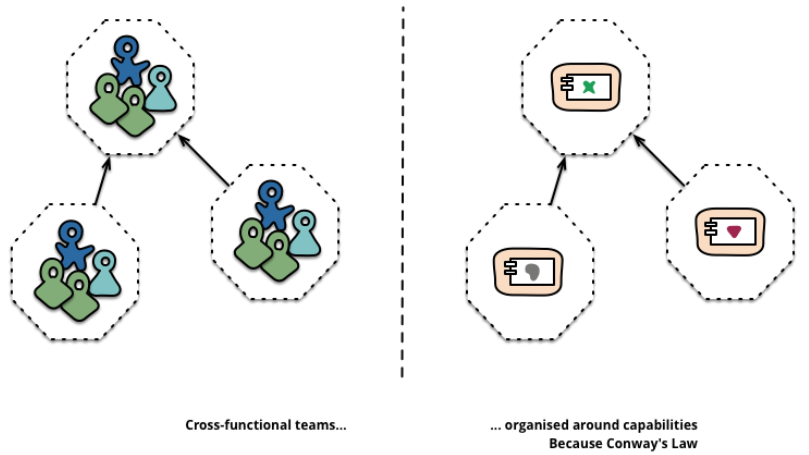

# 微服务概览 
技术的迭代总是在不断的遇到问题和解决问题，在具体学习微服务前，需要了解下为什么会有这个概念、它是如何产生的，那就不得不提早期应用的单体架构
## 单体架构
早期应用大多是单体架构，后端服务、前端页面都在写在同一个系统里，部署非常方便，直接打包部署即可，如图：

但这又带来了的新的问题：
- **开发人员需要掌握的较多**。当然早期vue什么的都还未流行，那会大多使用`ajax`,`jquery`，大家都是后端、前端一起开发、写单元测试
- **版本控制沟通成本大**。大家都在一个组内，系统就一个，提交、拉取、推送代码时要小心，最好是不要冲突。如果出现冲突了，解决该问题可能还需要别的开发来协助，毕竟一个系统，大家又分工合作，一般都是对自己负责的业务熟悉。因此才需要别的开发协助，别把同事的代码给勿删了。
- **后期维护难**。业务越复杂，代码量越大，原有系统代码增减越频繁，导致代码真的是一坨又一坨，没有谁一开始就能设计好完美架构，能适配未来所有场景。不然，也不会有此文章了。
- **部署容易，运维难**。因为是一个系统，只要代码有丁点儿改动，整个项目就要重新编译、打包、发镜像、发不同环境(测试、灰度、生产等)。笔者在前公司时，负责的一个财务系统非常复杂，是三个大系统合并后的，光编译+打包就得25分左右，快的时候18分（当时使用JDos发布），所以经常会有旁边同事说：”帮我发下XX项目，我去楼下抽根烟“......
- **测试不流畅，严重依赖全局**。笔者作为应届生，刚进入公司，正好遇上轮值测试岗，那会我们组专门有配备测试哥哥，曾跟着这个测试哥哥写过测试用例。整个测试用例，根据功能(或者说业务)来划分，然后再对应某个功能细分接口测试，写的非常详细，并且根据优先级来决定先测哪些系统。我仍记得17年那个冬天，因为一个开发小哥哥的项目有问题，导致后面的系统根本没法测试，而他的项目也没完成，也没法测试，只能等他解决了才能做后续步骤。测试环境早就搭好了，就等项目发布测试了，结果却来这一出，我们就这样干等了一下午，直到晚上快吃饭他才解决了。但是deadline是不变的，于是我们几个测试又加班加点开始一个一个测试，测出来问题就提BUG，催他们解决。这样的场景并不是只有这一次，说出来都是泪......
- **生产环境出问题影响大**。项目正常运行还好，但是一出事就是事故，本来A服务正常，却因为B服务挂掉，导致整个项目都挂，所以项目必须降级(手动切回老版本)，然后再解决问题，解决了再重新发布到新版本，最后leader组织复盘，吸取教训。

正是因为有上述问题，所谓的敏捷开发和部署(当时内部开始推广)成了空中楼阁，很多次会议都耗时、耗心，甚至影响到了组内团结。
## 微服务起源

大家经常谈论的是一个叫SOA(面向服务)的架构模式，它和微服务又是什么关系？你可以把微服务想成是SOA 的一种实践。

- 小即是美：小的服务代码少，bug 也少，易测试，易维护，也更容易不断迭代完善的精致进而美妙。
- 单一指责：一个服务也只需要做好一件事，专注才能做好。
- 尽可能早地创建原型：尽可能早的提供服务API，建立服务契约，达成服务间沟通的一致性约定，至于实现和完善可以慢慢再做。
- 可移植性比效率更重要：服务间的轻量级交互协议在效率和可移植性二者间，首要依然考虑兼容性和移植性。

后来在开发一个新项目时，leader采用了SOA架构，不过项目还是一个单体应用，并没有拆分为一个个单体服务，部署的时候也是整个系统部署，并非分布式部署。

不过这已经在进步了，那时基本上是通过XMl([标准通用置标语言](https://baike.baidu.com/item/%E6%A0%87%E5%87%86%E9%80%9A%E7%94%A8%E7%BD%AE%E6%A0%87%E8%AF%AD%E8%A8%80/10471466?fromtitle=%E6%A0%87%E5%87%86%E9%80%9A%E7%94%A8%E6%A0%87%E8%AE%B0%E8%AF%AD%E8%A8%80&fromid=6805073))来描述接口，在`.xml`文件中，定义了业务接口、provider、consumer等。(笔者之前是Java开发)

但本质上并没有解决上述问题，由于系统庞大，所以一个系统的`.xml`管理至关重要。当时我负责的财务系统本来是三大系统合并的，因此`.xml`文件繁多也复杂，在整理后，会有诸如此类的命名：`finance-XXX-provider.xml`、`finance-XXX-consumer.xml`、`workflow-XXX-provide.xml`、`workflow-XXX-consumer.xml`、`worker-XXX-provide.xml`、`worker-XXX-consumer.xml`等等...... 

当时流行一句话："要想搞定XX系统，看xml配置就行"。我不知道是谁提出来的，对于简单系统或许可行，但是对于极其复杂的系统，会遇到密密麻麻的`.xml`配置，有的有注释，有的没有，关键是不止这样一个文件，是很多，让你绝望的那种多......因此，项目维护和扩展的难度大大增大。

虽然项目架构进行了调整，但是也是模块化逻辑，最终它还是会打包并部署为单体式应用。其中最主要问题就是这个应用太复杂，以至于任何单个开发者都不可能搞懂它。应用无法扩展，可靠性很低，最终，敏捷性开发和部署变的无法完成。

对于上述问题，应对的思路便是：**化繁为简，分而治之**

## 微服务定义
后来微服务概念大行其道，到现在的云原生，我们先关注微服务，毕竟微服务是云原生的一个子集。
### 定义
**微服务**围绕业务功能构建的，服务关注**单一业务**，服务间采用**轻量级的通信机制**，可以**全自动独立部署**，可以使用**不同的编程语言和数据存储技术**。

微服务架构通过业务**拆分**实现**服务组件化**，通过**组件组合**快速开发系统，**业务单一的服务组件又可以独立部署**，使得整个系统变得清晰灵活。

### 特性
- 原子服务
- 独立进程
- 隔离部署
- 去中心化服务治理

## 微服务不足

Fred Brooks 在30年前写道：
> there are no silver bullets

但凡事有利就有弊，微服务也不是万能的。
- 微服务应用是分布式系统，由此会带来固有的复杂性。开发者不得不使用 RPC 或者消息传递，来实现进程间通信；此外，必须要写代码来处理消息传递中速度过慢或者服务不可用等局部失效问题。
- 分区的数据库架构，同时更新多个业务主体的事务很普遍。这种事务对于单体式应用来说很容易，因为只有一个数据库。在微服务架构应用中，需要更新不同服务所使用的不同的数据库，从而对开发者提出了更高的要求和挑战。
- 测试一个基于微服务架构的应用也是很复杂的任务。
- 服务模块间的依赖，应用的升级有可能会波及多个服务模块的修改。
- 基础设施的建设、复杂度高，对运维基础设施的挑战比较大。
- 服务拆分粒度不好把控，需要有多年实战经验，整体把控

## 组件服务化
传统实现组件的方式是通过库(library)，库是和应用一起运行在进程中，库的局部变化意味着整个应用的重新部署。 

通过服务来实现组件，意味着将应用拆散为一系列的服务运行在不同的进程中，那么单一服务的局部变化只需重新部署对应的服务进程。

我们用 Go 实施一个微服务：
- kit：一个微服务的基础库(框架)，如`go-kit`，`go-micro`，`dubbo-go`
- service：业务代码 + kit 依赖 + 第三方依赖组成的
业务微服务
- rpc + message queue：轻量级通讯，服务与服务间通信

本质上等同于，多个微服务组合(compose)完成了一个完整的用户场景(usecase)

如图：单体架构 -> 微服务架构

                                         

## 按业务组织服务
按业务能力组织服务的意思是服务提供的能力和业务功能对应，比如：订单服务和数据访问服务，前者反应了真实的订单相关业务，后者是一种技术抽象服务不反应真实的业务。

所以按微服务架构理念来划分服务时，是不应该存在`数据访问服务`这样一个服务的。

事实上传统应用设计架构的分层结构正反应了不同角色的沟通结构，如图所示，各个部门单独负责一个模块：

所以若要按微服务的方式来构建应用，也需要对应调整团队的组织架构。每个服务背后的小团队的组织是跨功能的，包含实现业务所需的全面的技能。如图所示，按一个微服务所需技术栈来拆分团队：

**示例模式：**

> 大前端(移动/Web) =》 网关接入 =》业务服务 =》平台服务 =》基础设施(PaaS/Saas)

## 去中心化
每个服务面临的业务场景不同，可以针对性的选择合适的技术解决方案。但也需要避免过度多样化，结合团队实际情况来选择取舍，要是每个服务都用不同的语言的技术栈来实现，想想维护成本真够高的。
### 技术去中心化
由于服务都拆分开，可单一部署维护，因此每个微服务的技术栈不再是强制唯一的，可以使用其他编程语言来实现，只要保证服务可用且有质量。

- 一般的，对于一个新项目，大都使用同一个语言贯穿整个项目周期
- 对于旧项目重构，比如改用其他语言重写，那么微服务的技术去中心化优势便提现的淋漓尽致。可以直接重构，然后部署、测试、一个一个服务逐渐上生产环境，运行稳定后就可以将旧服务切到新服务上
### 数据去中心化
每个微服务独享自身的数据存储(redis\mysql等)，不像传统应用共享一个缓存和数据库，这样有利于服务的独立性，隔离相关干扰。

服务与服务之间通过rpc通信来进行数据交互。
### 治理去中心化
一般的，服务治理通常是在API网关来统一进行服务治理，网关作为代理，主要用来处理外部服务的请求，并提供服务注册与发现、负载均衡、日志监控、容错等功能。

然而，这种方案也存在不足，比如
- **网关的单点故障**
- **系统架构变得异常庞大**
  
从功能来看，API 网关主要是面向用户，也就是说它可以解决从用户到各个后端服务的流量问题，至于其他问题，它可能就无能为力了。

一个能个稳定运行的微服务应用需要的是一个完整的贯穿整个请求周期的方案，或者至少是一些能够与 API 网关互补的方案和工
具，比如

- Service Mesh，又称服务网格，可以很好的解决上述问题，但也不是银弹，性能方面略有不足

## 基础设施自动化
无自动化不微服务，自动化包括测试和部署。

单一进程的传统应用被拆分为一系列的多进程服务后，意味着开发、调试、测试、监控和部署复杂度都会相应增大，必须要有合适的自动化基础设施来支持微服务架构模式，否则开发、运维成本将大大增加。

- CICD：Gitlab + Gitlab Hooks + k8s 或 Jenkins + k8s
- Testing：测试环境、单元测试、API自动化测试（如[yapi](https://yapi.baidu.com/doc/documents/index.html)）
- 在线运行时：k8s，以及一系列 Prometheus(监控)、ELK(日志采集、分析)、Conrtol Panle(微服务治理的控制面板)

## 可用性 & 兼容性设计
微服务架构采用粗粒度的进程间通信，引入了额外的复杂性和需要处理的新问题，如网络延迟、消息格式、负载均衡和容错等：
- 隔离
- 超时控制
- 负载保护
- 限流
- 降级
- 重试
- 负载均衡
  
忽略其中任何一点都属于对“分布式计算的误解”，所以微服务要落地好，在架构设计上要格外注意以上问题，遵循`Design For Failure`思想，可以理解为：
- 所有依赖的点都可能会出错
- 所有编写的代码都可能出问题

一旦采用了微服务架构模式，那么在服务需要变更时我们要特别小心，服务提供者的变更可能引发服务消费者的兼容性破坏，**时刻谨记保持服务契约(接口)的兼容性**。

所以要深刻理解这样一个理念：
> Be conservative in what you send, be liberal in what you accept.

即**发送时要保守，接收时要开放**。按照`伯斯塔尔法则`的思想来设计和实现服务时，发送的数据要更保守，意味着**最小化**的传送**必要**的信息，接收时更开放意味着要**最大限度的容忍冗余数据**，保证兼容性。