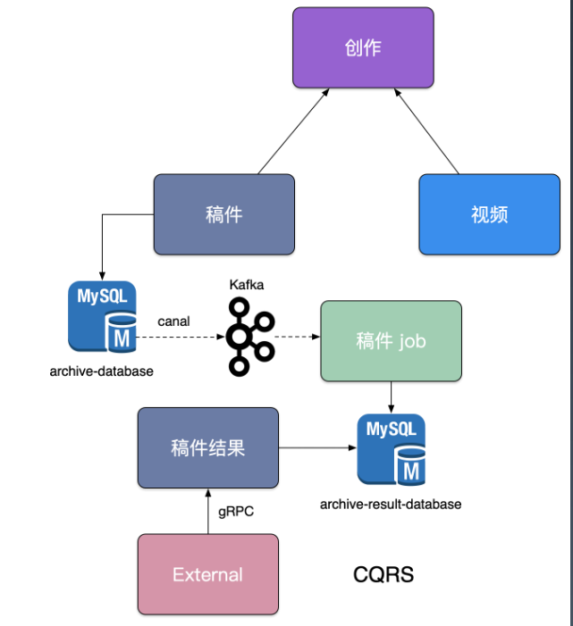

# 微服务设计
本文主要记录如何从SOA架构一步步进化到微服务架构，并成功在线上运行。

## API Gateway 演进

### 1.0版本：SOA架构下的问题 
SOA架构下，按照垂直功能进行了拆分，对外暴露了一批微服务，具体架构如图:

但是因为缺乏统一的出口面临了不少困难：
- 客户端到微服务直接通信，强耦合：
  - 浏览器还好，但是移动端面临诸多问题，比如用户始终不愿意将app升级，依然使用旧版本，意味着服务要有很强的兼容性，不能顾此失彼。
    
- 移动端需要多次请求，客户端聚合数据，工作量巨
大，延迟高。
  - 移动端团队与其他业务方沟通成本大。聚合一个合格的数据，可能需要调用不同的接口，这就意味着需要和不同团队联调接口，接口改动了，移动端也得跟着改，并且接口规范不一定统一，增加了心智负担，协调成本大，工作量也大。
  - 客户端团队接口维护困难。一个页面可能需要调很多接口才能返回合格数据，导致多次请求，延迟高，有些接口可能还会失败，无法降级。
- 协议不利于统一，各个部门间有差异，需要端来兼容。
- 面向“端”的API适配，耦合到了内部服务。
  - 为了适应不同型号的操作系统，如IOS 5.X\6.X，安卓不同版本，需要在内部服务中适配这些终端，字段需求不一致，对应的服务也要进行适配，保证用户使用app流畅。
- 多终端兼容逻辑复杂，每个服务都需要处理。
- 统一逻辑无法收敛，比如安全认证、限流。

为了留存用户，提升流量，应用发版就要迭代较快，尤其是app端，因此每一次发版既要保证质量还要讲究效率。所以，一些较复杂的工作可以交给服务端处理，如数据的组装聚合，尽量做到“前轻后重”，即前端轻，后端重

在这种场景下，就需要引入API Gateway，提供友好的面向业务场景的API。

### 2.0版本：初步引入BFF 
我们新增了一个 `api-interface` 用于统一的协议出口，在服务内进行大量的 dataset join，按照业务场景来设计粗粒度的 API,架构如图：

这给后续服务的演进来的很多优势：
- 轻量交互：协议精简、聚合。
- 差异服务：数据裁剪以及聚合、针对终端定制化API。
  - 针对不同网络情况，比如3g,4g,5g，不同终端，差异性定制化API
- 动态升级：原有系统兼容升级，更新服务而非协议。
  - 业务服务可以随时迭代升级，只要保证和BFF层的接口兼容即可
- 沟通效率提升：协作模式演进为移动业务对接网关小组，其他业务组直接和网关组对接即可。不再是移动组直接对接多个业务组了

`BFF`(面向前端场景的后端服务)可以认为是一种适配服务，将后端的微服务进行适配(主要包括聚合裁剪和格式适配等逻辑)，向无线端设备暴露友好和统一的 API，方便无线设备接入访问后端服务
### 3.0版本：优化BFF 
2.0版本架构最致命的一个问题是整个 `api-interface` 属于`single point of failure`(单点故障)，严重代码缺陷或者流量洪峰可能引发集群宕机，即如果BFF层宕机，那么和其有依赖的业务服务就全炸了。

因此，为了解决以上问题，针对不同业务领域，BFF层创建了对应的`xxx-interface`，架构如图：

除此之外，仍存在以下问题：
- 单个模块也会导致后续业务集成复杂度高，根据康威定律，单块的无线BFF和多团队之间就出现不匹配问题，团队之间沟通协调成本高，交付效率低下。

- 很多**跨横切面**逻辑，比如安全认证，日志监控，限流熔断等。随着时间的推移，代码变得越来越复杂，技术债越堆越多。

第二个问题尤其是在安全认证，日志监控，限流熔断这些基础库要迭代升级的时候，每次更新版本，都要将BFF层中的服务全部跟着升级一遍，如果服务过多，这是一个不小的工作量。

补充知识：[AOP切面编程](../docs/03-AOP切面编程.md)

### 4.0版本：新增API Gateway 
于是，在3.0版本的基础上，架构又一次进行了演进，将跨横切面的逻辑全部下沉，如安全认证、日志监控、限流熔断、路由管理，便引入了 `API Gateway` 。

把业务集成度高的 `BFF` 层和通用功能服务层 `API Gateway` 进行了分层处理。
 

在新的架构中，网关承担了重要的角色，它是**解耦拆分**和**后续升级迁移**的利器。在网关的配合下，单块 `BFF` 实现了解耦拆分，各业务线团队可以独立开发和交付各自的微服务，研发效率大大提升。

另外，把跨横切面逻辑从 `BFF` 剥离到网关以后，`BFF` 的开发人员可以更加**专注业务逻辑交付**，实现了**架构上的关注分离**(Separation of Concerns)。

至此，业务流量的流转路径实际为：

> 移动端/网页端 -> `API Gateway` -> `BFF` -> `Mirco Service`

对于纯前端FE Web业务，`BFF` 可以是 nodejs 来做服务端渲染(SSR，Server-Side Rendering)。

**注意：** 这里流转路径忽略了网关上游的 `CDN`、4/7层负载均衡(`ELB`)等。

补充知识：[四层、七层负载均衡的区别](https://mp.weixin.qq.com/s/9POrwe3jrE1kChps6r-osQ?)

## 微服务划分
### 如何划分服务的边界
微服务架构时遇到的第一个问题就是**如何划分服务的边界**。

在实际项目中通常会采用两种不同的方式划分服务边界，即通过业务职能(Business Capability)或是 `DDD` 的限界上下文(Bounded Context)。
- Business Capability：由公司内部不同部门提供的职能。例如客户服务部门提供客户服务的职能，财务部门提供财务相关的职能。
- Bounded Context：限界上下文是DDD 中用来划分不同业务边界的元素，这里业务边界的含义是“解决不同业务问题”的问题域和对应的解决方案域，为了解决某种类型的业务问题，贴近领域知识，也就是业务。

那微服务的粒度到底拆多细合适呢？可以尝试关注以下几点：
- **第一：从组织结构来讲，拆分后的微服务是否能形成闭环。** 这里的闭环指的是闭环团队去专攻一个服务，尽量避免一个功能散列在其他横向的职能部门中
- **第二：从调用频率来讲，一个服务是否会被很多个业务调用。** 比如以B站账号服务为例，可以拆分为用户信息服务、VIP服务、关注服务、用户装备服务、用户等级服务等，粒度很细。但是账号服务是频繁被调用的，调用方每次要获取用户的相关内容时，都要调很多不同的服务，导致调用方不仅要处理自己的逻辑，还要处理不同服务的返回错误(每个都要处理)，如果流程中间有一个服务报错，调用方也不好降级处理。因此，像类似账号服务的应用场景不推荐被划分的太细，推荐采用DDD思想，抽象出账号领域服务。其中，账号实体为聚合根，VIP实体、用户等级实体、用户装实体备、关注信息实体等可以作为账号实体的值对象，相关业务逻辑和事件处理可以收敛在账号领域服务中。
- **第三：从客户/用户角度来讲，一个服务(功能)是否能够闭环的解决掉用户的一个场景问题。** 无论是To B还是To C，客户/用户的体验和诉求都是第一位的，能提供稳定、好用的功能，能积极拥抱客户变化，并且出了问题能够高效、及时的处理，这样的服务便适合拆分为一个单独服务
 
### CQRS 

`CQRS`——Command Query Responsibility Segregation。顾名思义将应用程序分为两部分：命令端和查询端。
- 命令端处理新增，更新和删除请求，并在数据更改时发出事件。
- 查询端通过针对一个或多个物化视图执行查询来处理查询，这些物化视图通过订阅数据更改时发出的事件流而保持最新。不会对数据产生变化的操作，只是按照某些条件查找数据

在稿件服务演进过程中，我们发现围绕着创作稿件、审核稿件、最终发布稿件有大量的逻辑揉在一块，其中稿件本身的状态也有非常多种，但是最终前台用户只关注稿件能否查看，我们依赖稿件数据库binlog 以及订阅binlog 的中间件canal，将我们的稿件结果发布到消息队列kafka 中，最终消费数据独立组建一个稿件查阅结果数据库，并对外提供一个独立查询服务，来拆分复杂架构和业务，架构如图:

其实就是读写分离，分成了两个库:`archive`和`archive_result`，通过canal订阅`archive`库的binlog **+** `MQ`来保证两个库的数据一致性。

补充知识：[DDD 中的那些模式 — CQRS](https://zhuanlan.zhihu.com/p/115685384)

### 微服务安全
#### 外网安全
对于外网的请求来说，我们通常在 API Gateway 进行统一的认证拦截，一旦认证成功，我们会使用`JWT` 方式通过`RPC` 元数据传递的方式带到`BFF` 层，`BFF` 校验Token 完整性后把身份信息注入到应用的`Context` 中，`BFF` 到其他下层的微服务，建议是直接在 RPC Request 中带入用户身份信息(`UserID`)请求服务，架构如图：

链路请求流程：
- API Gateway -> BFF -> ServiceBiz Auth  -> JWT -> Request Args

#### 内网安全
对于服务内部，一般要区分身份认证和授权。
- 先身份认证，比如基于证书可以知道对方是谁。
- 后授权，比如基于RBAC的权限认证
