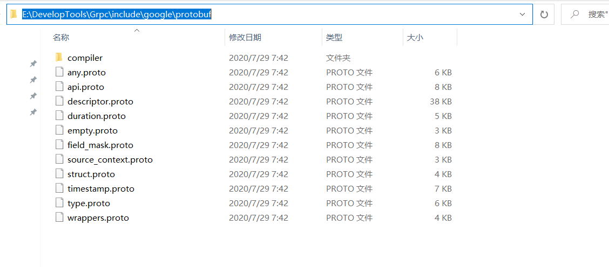
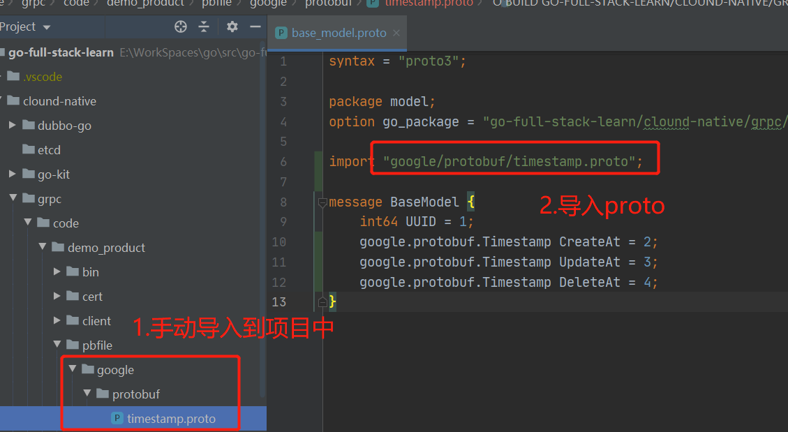

# gRPC初识

`gRPC`是什么可以用官网的一句话来概括:
> A high-performance, open-source universal RPC framework

微服务架构下，需要处理的一个非常核心的问题：**服务与服务之间如何通信**

目前主流的通信方式如下：
- HTTP：通常是编写RESTful接口，走http协议
- JSON-RPC：是一个无状态且轻量级的远程过程调用（RPC）传送协议，其传递内容透过 JSON 为主。
- thrift：Facebook开源的RPC框架，是一种接口描述语言和二进制通讯协议，它被用来定义和创建跨语言的服务
- gRPC：Google开源的RPC框架， 是一个高性能、开源和通用的 RPC 框架，面向移动和 HTTP/2 设计，基于 HTTP/2 标准设计，带来诸如双向流、流控、头部压缩、单 TCP 连接上的多复用请求等特。这些特性使得其在移动设备上表现更好，更省电和节省空间占用。

我们选用gRPC作为RPC框架
## 特性
- 轻量级、高性能：序列化支持PB(Protocol Buffer)和JSON，PB 是一种语言无关的高性能序列化框架。
- 可插拔
- IDL：交互式数据语言Interactive Data Language。基于文件定义服务，通过proto3工具生成指定语言的数据结构、服务端接口以及客户端Stub。
- 移动端：基于标准的HTTP2设计，支持双向流、消息头压缩、单TCP的多路复用、服务端推送等特性，这些特性使得gRPC在移动端设备上更加省电和节省网络流量
- 服务而非对象、消息而非引用：促进微服务的系统间粗粒度消息交互设计理念。
  - 服务而非对象：在gRPC中，每一个服务定义使用关键字service，并不是某个Class(Java,C#)或Struct(C,Go)
  - 消息而非引用：每个数据传输载体是一个消息，使用关键字message定义，并不是引用某个Class(Java,C#)或Struct(C,Go)
- 负载无关的：不同的服务需要使用不同的消息类型和编码，例如protocol buffers、JSON、XML和Thrift。
- 流：Streaming API。
- 阻塞式和非阻塞式：支持异步和同步处理在客户端和服务端间交互的消息序列。
- 元数据交换：常见的横切关注点，如认证或跟踪，依赖数据交换。
- 标准化状态码：客户端通常以有限的方式响应API调用返回的错误。


gRPC 客户端和服务端可以在多种环境中运行和交互——如从 google 内部的服务器到你自己的电脑，并且可以用任何 gRPC 支持的语言来编写。

所以，你可以很容易地用 Java 创建一个 gRPC 服务端，用 Go、Python、Ruby 来创建客户端。此外，Google 最新 API 将有 gRPC 版本的接口，使你很容易地将 Google 的功能集成到你的应用里。


## 开发使用优势
由于接口定义可以在PB文件详细描述，因此，开发人与可以基于对应的服务PB文件来作为API文档。
- 大大减少了跨部门的沟通，大家都去看PB文件就能知道接口定义
- 新员工也能快速了解项目有哪些接口定义，省去了很多学习成本

## 使用及安装

### grpc 使用

如果是使用go moudle 开发项目，直接导入以下包，IDE(如[Goland](https://www.jetbrains.com/go/))会自动安装：
```go
import "google.golang.org/grpc"
```
或者在终端执行命令，加`-u`直接会拉取最新版本：
```sh
$ go get -u google.golang.org/grpc
```
简单一行就能创建一个RPC Server，更多使用请看：[gRPC学习笔记]()
```go
grpc.NewServer(args)

```
### 安装PB编译器

官方版本安装：[目前最新是3.14版本](https://github.com/protocolbuffers/protobuf/releases/tag/v3.14.0)


下载后，将`bin`目下的执行文件 `protoc.exe` 移动到 GOPATH/bin目录下，这样就能使用 `protoc` 命令来生成相关go代码了。

###  不要忽略 include 文件夹中的内容

下载的压缩包里还有一个非常重要的目录 `include` 目录，里面存储了 grpc 认为不太常用的 `.proto` 文件，都是定义好的，可以直接 import 来使用的。include目录内容如图：



我们在实际开发的时候可能会用到里面相关的 .proto 文件，比如 timestamp.proto，这时候需要我们手动将其移动到项目中去。如图：



要在图中目录 `pbfile` 下运行生成代码命令，这样就可以 `import "google/protobuf/timestamp.proto";` 就不会报如下错误了：

>google/protobuf/timestamp.proto: File not found. 

## Protocol buffers

gRPC 默认使用 `protocol buffers`，这是 Google 开源的一套成熟的结构数据序列化机制（当然也可以使用其他数据格式如 JSON），用 `protocol buffers` 消息类型来定义方法参数和返回类型。它拥有轻量简化的语法、一些有用的新功能，并且支持更多新语言。

在`golang/protobuf` Github 源码库里还有针对 Go 语言的生成器， 对更多语言的支持正在开发中。

`proto3`有一套自己的语法，你可以在 [proto3语言指南](https://blog.csdn.net/hulinku/article/details/80827018)里找到更多内容。


