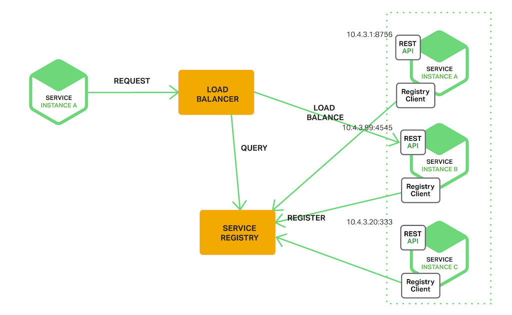
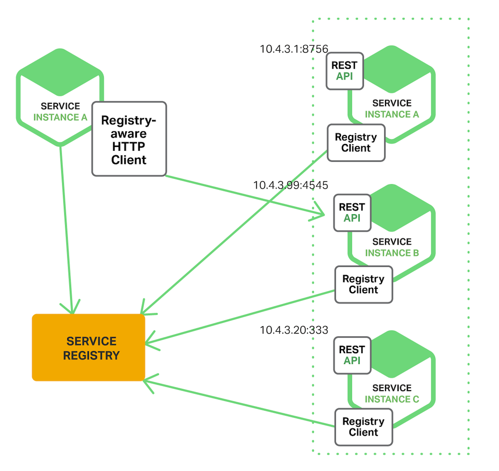
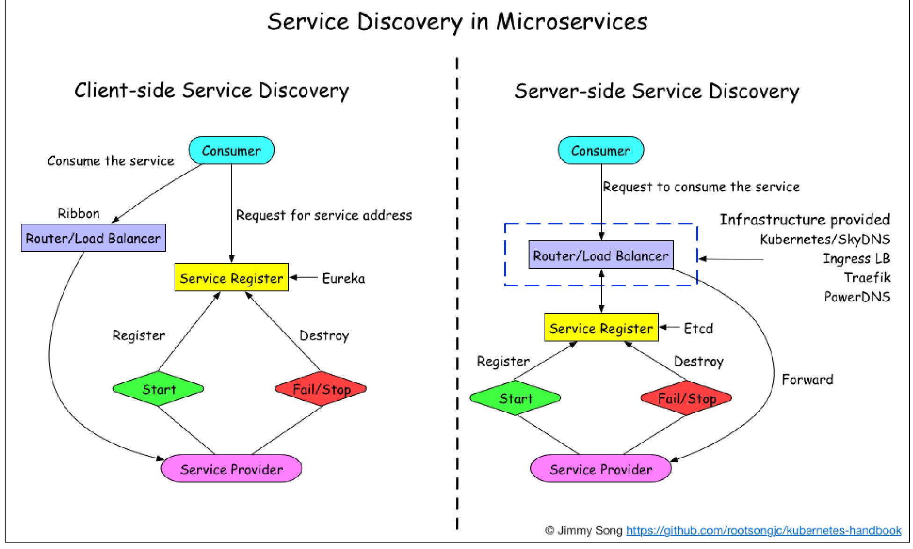

# 服务发现

服务发现基本架构图：

## 服务端服务发现
客户端通过负载均衡器向一个服务发送请求，这个负载均衡器会查询服务注册表，并将请求路由到可用的服务实例上。服务实例在服务注册表上被注册和注销(Consul Template+Nginx，kubernetes+etcd)。

如图：

服务端服务发现需要先走一个服务注册中心，比如Nacos,K8s等组件，然后在注册中心通过负载均衡策略分配服务调用

可以看到，服务provider和服务consumer之间有个中介——服务注册中心，这样会多走一次网络调用，多一点网络耗时。

Consumer 无需关注服务发现具体细节，只需知道服务的 DNS 域名即可，支持异构语言开发，需要基础设施支撑，多了一次网络跳转，可能有性能损失。

## 客户端服务发现
一个服务实例被启动时，它的网络地址会被写到注册表上；当服务实例终止时，再从注册表中删除；这个服务实例的注册表通过心跳机制动态刷新；客户端使用一个负载均衡算法，去选择一个可用的服务实例，来响应这个请求。

如图：

客户端服务发现是直连方式，服务consumer直接调用服务provider，不会多走一次网络跳转，Consumer 需要内置特定的服务发现客户端和发现逻辑，当然也会通过负载均衡策略来分配服务调用

**客户端服务发现和服务端服务发现比较图** :

## 健康检查
什么是健康检查？

Health Check，检查对端是否可用，一般在以下关键节点会有health check：
- 服务provider和服务consumer之间，保证服务之间调用是正常的
- 注册中心和服务provider之间，保证注册中心能感知到服务provider是正常的，这样在负载均衡时才会考虑分配该服务
- 注册中心和服务consumer之间，保证注册中心能感知到服务consumer是正常的，这样在负载均衡时才会考虑分配该服务

> 备注：服务消费者和服务提供者对于服务注册中心来讲，都是客户端

