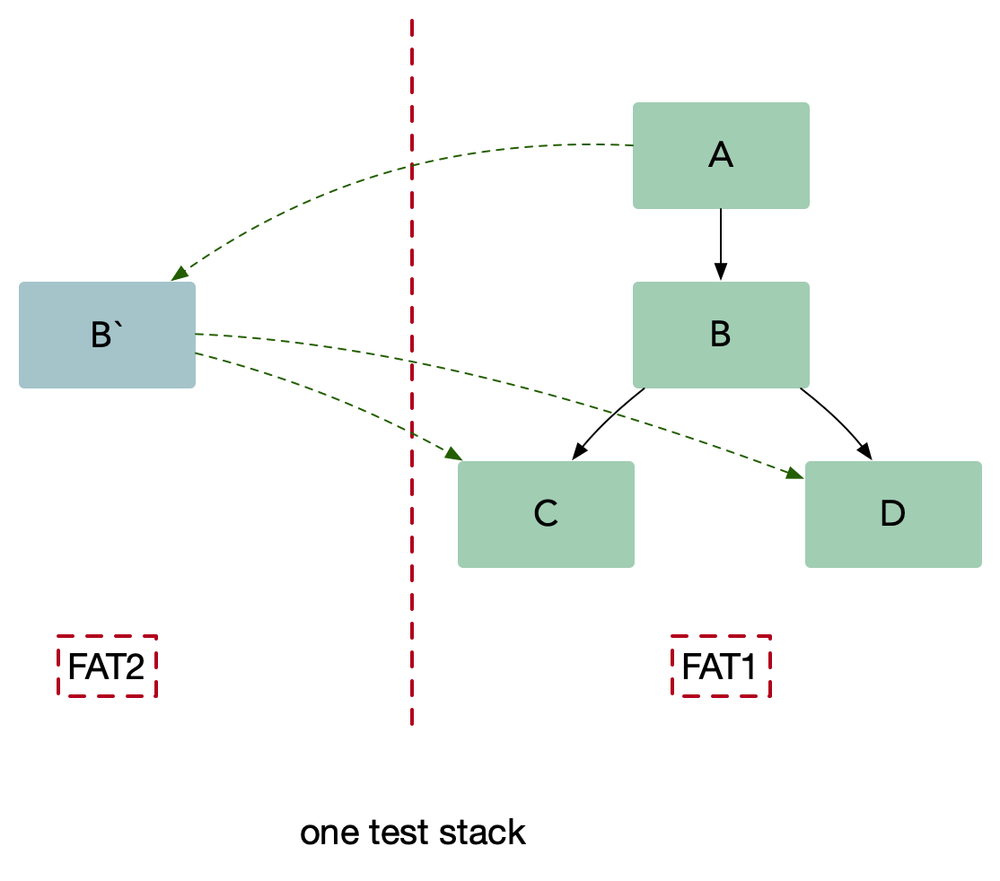

# 多集群多租户

## 多集群

顾名思义，多个集群部署应用，因为单个集群（可能包含多个节点）无法满足日益增长的流量需求

## 多租户
在一个微服务架构中**允许多系统共存**是利用**微服务稳定性以及模块化**最有效的方式之一，这种方式一般被称为多租户(multi-tenancy)。

租户可以是测试，金丝雀发布，影子系统(shadow systems)，甚至服务层或者产品线，使用租户能够**保证代码的隔离性并且能够基于流量租户做路由决策**。

对于传输中的数据(data-in-flight)（例如，消息队列中的请求或者消息）以及静态数据(data-at-rest)（例如，存储或者持久化缓存），租户都能够**保证隔离性和公平性**，以及**基于租户的路由机会**。

如果我们对服务 B 做出改变，我们需要确保它仍然能够和服务 A，C，D 正常交互。在微服务架构中，我们需要做这些集成测试场景，也就是测试和该系统中其他服务的交互。通常来说，微服务架构有两种基本的集成测试方式：并行测试和生产环境测试。

如图：

### 应用场景
**多环境发布应用**：
- 测试环境
- 灰度环境
- 生产环境

并行测试需要一个和生产环境一样的过渡(staging)环境，并且只是用来处理测试流量。

在并行测试中，工程师团队首先完成生产服务的一次变动，然后将变动的代码部署到测试栈。

这种方法可以在不影响生产环境的情况下让开发者稳定的测试服务，同时能够在发布前更容易的识别和控制 bug。尽管并行测试是一种非常有效的集成测试方法，但是它也带来了一些可能影响微服务架构成功的挑战：
- 混用环境导致的不可靠测试。
- 多套环境带来的硬件成本。
- 难以做负载测试，仿真线上真实流量情况。

**那具体怎么区分环境？**：
- 测试方发送请求时会在 Header 中添加某个约定好的字段值，如果 `prd`或 `dev`等来区别环境
- 服务方从上下文（Go中是context）中获取该值，这样就能调用不同环境的服务了

使用这种方法(也可称为染色发布)，我们可以把待测试的服务 B 在一个隔离的沙盒环境中启动，并且在沙盒环境下可以访问集成环境(UAT) C 和 D。

我们把测试流量路由到服务 B，同时保持生产流量正常流入到集成服务。服务 B 仅仅处理测试流量而不处理生产流量。

另外要确保集成流量不要被测试流量影响。生产中的测试提出了两个基本要求，它们也构成了多租户体系结构的基础：

- 流量路由：能够基于流入栈中的流量类型做路由。
- 隔离性：能够可靠的隔离测试和生产中的资源，这样可以保证对于关键业务微服务没有副作用。

如图：

> **注意：灰度测试成本代价很大，影响 1/N 的用户。其中 N 为节点数量。**